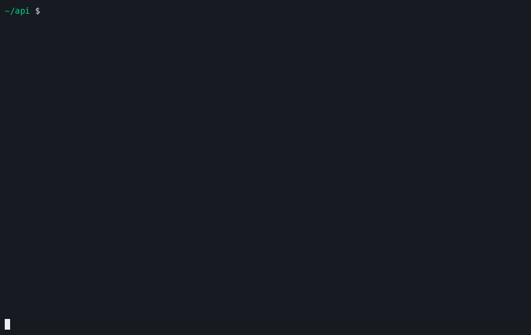

# srcy

**An IDE around the coding agent you already use.**

`claude`, `codex`, `opencode`, `pi`, `gemini`, `aider` — whichever binary you
name runs in the big pane exactly as it runs in a bare terminal. Own slash
commands, own keybinds, own scrollback, own mouse. srcy is the panes around
it.



<sub>Launch → the turn → GATES goes red → pin a file → walk its hunks and the
file before it → zoom the agent full screen → drag the border → the fix lands
green. Real layout, real git repo, real transcript, real checker, all changing
while the panels read them. Only the agent's turn is scripted — `npm run demo`
reproduces it.</sub>

---

## Why

An agent's pane is a **log**: every fact printed once, then buried under the
next forty tool calls. srcy is **state** — the plan *now*, the diff *so far*,
whether it compiles *at this moment*.

|  | agent's pane | srcy |
|---|---|---|
| the plan | printed once, 40 calls ago | on screen |
| what changed | one hunk at a time | whole tree, marked — and every hunk, scrollable |
| does it build | whatever it said last | run against the tree that exists |
| how long has this call been running | — | `⟳ 13s Bash npm test` |

---

## Install

Needs **Node 20+**, **git**, **tmux**, and your agent CLI already logged in.

```bash
git clone https://github.com/sajjadriaj/srcy.git && cd srcy
npm install     # builds on install
npm link        # puts `srcy` on your PATH
```

Undo with `npm unlink -g srcy`.

---

## Use

Run inside any git repo.

| command | does |
|---|---|
| `srcy` | claude, in this repo |
| `srcy --agent codex` | any binary — the name *is* the command |
| `srcy --agent "claude --model opus"` | with its own flags |
| `srcy -- claude --model opus` | everything after `--` is the agent's argv |
| `srcy --name review` | a second session on the same repo |

- Re-running `srcy` **re-attaches** instead of starting a second session.
- Session name = repo basename + hash of its path, so `~/work/api` and
  `~/side/api` never collide.
- Quitting the agent ends the session. A mistyped flag is refused, not ignored.

srcy runs on its own tmux server:

```bash
tmux -L srcy ls            # what srcy has running
tmux -L srcy kill-server   # stop all of it
```

### Keys

Keys are tmux's, because it *is* tmux.

| key | |
|---|---|
| `ctrl-b o` / `ctrl-b ←→` | next pane / pane by direction |
| `ctrl-b z` | zoom a pane full screen |
| `ctrl-b d` | detach — the agent keeps working |
| mouse | click to focus, drag a border, scroll back |

With the keyboard in the sidebar:

| key | |
|---|---|
| `j` `k` / `↓` `↑` | move the cursor |
| `⏎` `space` | open/close a directory — on a file, pin the review pane to it |
| `r` | run every gate now, including the ones that don't run themselves |
| `c` | checkpoint: everything after this is *this* turn |

With the keyboard in the review pane:

| key | |
|---|---|
| `n` `p` | next / previous changed file |
| `]` `[` | next / previous hunk |
| `j` `k` / `↓` `↑` / `PgDn` `PgUp` | scroll |
| `g` `G` | top / bottom of the diff |
| `f` | back to following the agent's newest write |
| `1` `2` `3` | review this turn / this session / everything uncommitted |

The agent keeps every other keystroke. Both panels are inert until you move
the keyboard to them.

Under 72 columns the agent starts zoomed — three panes that narrow are three
unreadable ones — and `ctrl-b z` is the way back to the panels.

---

## Panels

| panel | reads | notes |
|---|---|---|
| **REPO** | `git` | whole project; directories closed except the ones holding a change. Failing files turn red and spend the churn column on the failure count |
| **GOAL** | agent's session log | what you asked for, in your words, after forty tool calls buried it |
| **PLAN** | agent's session log | still there 40 tool calls later |
| **GATES** | `.srcy/config.json` or `.srcy/check` | one row per gate. Automatic ones run when the diff *stops* moving; the rest wait for `r`. Stale verdicts say `code moved since` |
| **gauge** | agent's session log | `53% 106k/200k cache 99%` |
| **REVIEW** | `git` + GATES | every hunk of every changed file, scrollable. Follows the newest write until you pin a file. Heads the diff with what the gates actually said |

**Details worth knowing**

- **The cursor holds a file, not a row.** The agent creates and deletes files
  while you read; a row number silently means a different file.
- **Hand-opened directories are overrides.** Everything you haven't touched
  still opens itself for a change.
- **An in-place edit counts as a change.** Replacing a line with a different
  line leaves `+1 -1` exactly as it was — so the tree is identified by content,
  not by churn counts. Otherwise the fix for the bug the agent introduced three
  seconds ago never re-runs the checker.
- **Nothing reports passing before it has run.** `not run yet` ≠ `passing` ≠
  `none configured` ≠ `timed out`. A gate that ran out of time proved nothing
  either way, so it is not rewritten to "failing".
- **FOLLOW and PINNED are both visible, and both reversible.** Anything you
  press in the review pane pins it — having the agent's next write yank the
  pane mid-sentence is what makes a live pane useless for reading. `f` gives
  it back.
- **A scope with no baseline shows nothing and says why.** `TURN` never
  quietly falls back to `HEAD`: a diff labelled "this turn" that is really
  every uncommitted line is worth less than an empty pane that admits it.
- **Occupancy is the last request's, never a running total.** Cumulative counts
  reach millions against a 200k window and would peg the gauge forever.
- **`cache` is the bloat reading.** Healthy sits near 99%; a session
  re-sending its whole context every turn shows it collapsing.
- **New files count their whole length.** `+0 -0` on a file that didn't exist
  an hour ago reads as "nothing happened here".
- srcy adds **nothing** to the context window. Every token in there is the
  agent's.

### What gets verified

`.srcy/check` — any executable, any language. Non-zero means failing.
`path:line: msg` and `path(line,col): msg` are parsed into the list.

```bash
mkdir -p .srcy && cat > .srcy/check <<'EOF'
#!/bin/sh
cargo check --message-format short 2>&1
EOF
chmod +x .srcy/check
```

Without one, srcy falls back to your `typecheck` or `build` npm script.

For more than one, `.srcy/config.json`:

```json
{
  "gates": [
    { "name": "typecheck", "command": ["npm", "run", "typecheck"] },
    { "name": "unit", "command": ["npm", "test"], "auto": false },
    { "name": "lint", "command": ["npx", "eslint", "."], "timeoutMs": 60000 }
  ]
}
```

| field | |
|---|---|
| `command` | a list of words, never a shell line. Need a shell? That's what `.srcy/check` is |
| `auto` | default `true` — runs itself once the tree stops moving. `false` waits for `r` |
| `timeoutMs` | default 120000, capped at ten minutes |

Gates run one at a time: they're your own commands, and two compilers over one
tree cost more than they save. A malformed config is shown in GATES and falls
back to the detected command — one bad gate invalidates the list rather than
being silently skipped.

Commit either — it's project config, like a lint file.

### Three answers to "what changed"

`1` `2` `3` in the review pane:

| scope | since |
|---|---|
| `TURN` | the newest thing you asked for, or your last `c` |
| `SESSION` | srcy opening this repo |
| `HEAD` | the last commit — every uncommitted line, staged or not |

A baseline is a git tree captured through a throwaway index: your real index
and worktree are never touched, and srcy stages, commits and reverts nothing.

`TURN` is taken the moment your request lands, then checked against the
transcript again: if the agent had already started writing, the baseline is
thrown away and the pane says so rather than hiding half the turn. Press `c`
to set one by hand — which is also how `TURN` works for an agent whose
session format srcy cannot read.

---

## How it works

**tmux hosts the layout.** That's why the agent stays native — tmux already
solves the pty, resize protocol, scrollback, mouse and copy-paste. The agent
gets a real terminal because it *is* in one.

**On srcy's own socket.** Agents ask their terminal for things — Claude Code
wants `focus-events`, pi wants `extended-keys` — and those are *server-wide*
in tmux. On a shared server they'd reach into every other session you have
open and stay on after srcy exits. Your `~/.tmux.conf` still loads.

**The panels never speak to the agent.** No protocol, no adapter. git and your
checker work for every agent — and for a person with an editor open. Only
`GOAL`, `PLAN`, the gauge and the automatic `TURN` baseline are per-agent:

| agent | `GOAL` | `PLAN` | gauge |
|---|---|---|---|
| `claude` | yes | yes | yes — window inferred (200k, or 1M once past it) |
| `codex` | yes | when it calls `update_plan` | yes — against the window codex records itself |
| anything else | blank | blank | blank |

Blank, never another agent's numbers — and `c` sets the turn baseline by hand
wherever srcy cannot read one.

<details>
<summary>The same repo under <code>srcy --agent codex</code></summary>

Same panels, no adapter — GOAL and PLAN come from codex's own session log.
The gauge reads `161k/258k` because codex records the model's real context
window with every token count — measured, where Claude Code's is inferred.
`PREVIEW_AGENT=codex npm run preview` prints this.

```
──  ⟳ 52s shell bash -lc np…──┬──  codex  ──────────────────────────────────────────────────────────
REPO                          │user
▸  .srcy/                     │  fix the token expiry off-by-one
▸  docs/                      │
▾  src/                       │codex
▾    auth/                    │  The expiry check is exclusive: a token that expires on this exact
▪►     expiry.test.ts +1 -0   │  millisecond is still accepted. Changing < to <= in verify().
        hash.ts               │
✖      session.ts     ✖1      │  exec  bash -lc "npm run typecheck"
▪      token.ts       +1 -1   │
▸    http/                    │
─ GOAL ───────────────────────│
  fix the token expiry off-by…│
─ PLAN ───────────────────────│
  ✔ find the expiry comparison│
  ✔ fix the off-by-one        │
  ▸ add a regression test     │
─ GATES 0/1  1 to look at ────│
  check      ✖ 1 in 1         │
  session.ts:3                │
▮▮▯▯ 62% 161k/258k cache 100% │
──  REVIEW  HEAD  FOLLOW  1/2 files  1/1 hunks  src/auth/session.ts  ───────────────────────────────
  ✖ src/auth/session.ts:3  error TS2532: Object is possibly 'undefined'.
   1   export class Session {
   2 +   private renewals = 0
   3 +   renew() { this.renewals++ }
   4   }
 ]/[ hunk · n/p file · j/k scroll · f follow · 1/2/3 turn/session/head
```
</details>

<details>
<summary>Why the panels share a file instead of a tmux option</summary>

The sidebar and the diff pane are separate processes, so the picked file and
the check result have to cross between them. That was a tmux user option.
Measured on tmux 3.4:

```
set-option, ~16 KB+ value   →  "command too long"
"a$b"  set, then read back  →  "a\$b"     (display-message and show-options)
```

The second is enough to make `JSON.parse` throw on any error message
mentioning a shell variable. One small file named after the session has
neither limit and costs no process per poll.
</details>

<details>
<summary>Colour and glyphs</summary>

Green wrote, red failed, dim is background you may skip. Every marker is one
cell wide in every terminal — the obvious ones (`●` `○` `▶` `█`) are
East-Asian *ambiguous* and render two cells under some terminal settings,
which tears a fixed-width column.
</details>

---

## Development

```bash
npm test           # node:test, no framework
npm run typecheck
npm run preview    # the layout over a fixture repo, as one frame
npm run demo       # re-record docs/demo.cast
npm run demo:gif   # cast -> gif (needs `agg`)
```

`npm run preview` is how to iterate on the panes — real layout, fixture repo,
no agent, no waiting on a turn. `PREVIEW_COLS` / `PREVIEW_ROWS` set the size.

Dependencies: `ink`, `react`. That's the list.

## Licence

MIT
